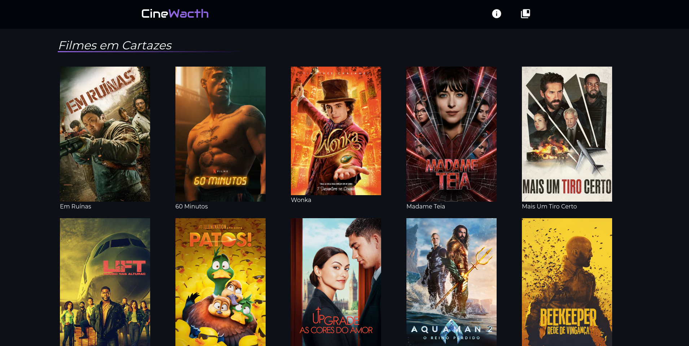
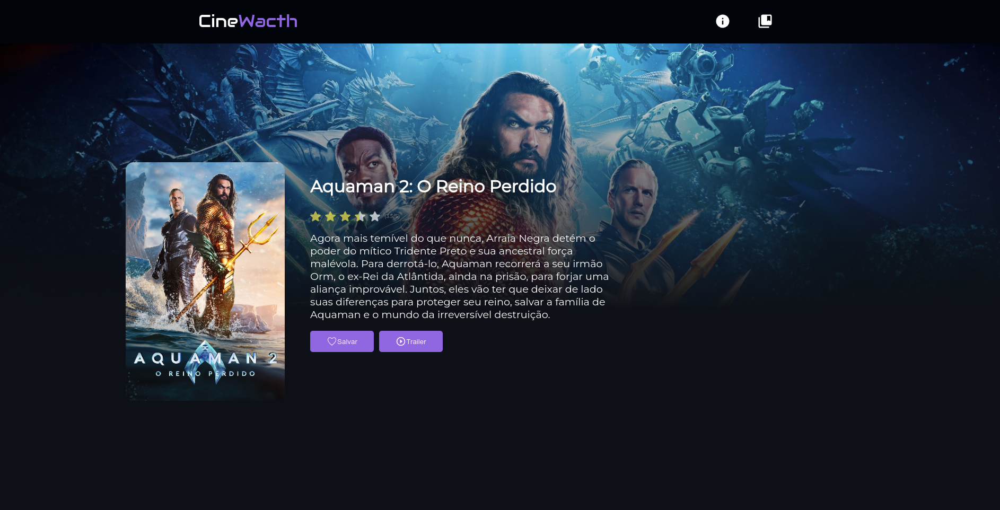

<h1 align="center": center">CineWacth</h1>

CineWatch é uma aplicação web desenvolvida para entusiastas de cinema que desejam estar atualizados sobre os principais filmes em alta nos cartazes do mundo. Com uma interface intuitiva e fácil de usar, CineWatch permite que os usuários descubram informações detalhadas sobre os filmes mais populares, incluindo descrições, avaliações e muito mais. Além disso, os usuários têm a conveniência de salvar seus filmes favoritos em uma lista personalizada para referência futura.

<h3 align="center">Confira meu projeto <a href="https://my-portfolio-pedrosrc.vercel.app/">clicando aqui🔗</a></h3>

### Tela Inicial

### Tela sobre o Filme

## Funcionalidades Principais

Listagem de Filmes em Alta
CineWatch oferece uma lista atualizada dos principais filmes em alta nos cinemas de todo o mundo. Os usuários podem facilmente navegar por esta lista e encontrar os filmes que desejam saber mais.

Detalhes do Filme
Para cada filme listado, os usuários podem acessar informações detalhadas, incluindo uma descrição completa do enredo, elenco, diretor, classificação indicativa e avaliações dos críticos.

Salvar na Lista de Favoritos
Os usuários têm a capacidade de salvar os filmes que desejam assistir mais tarde em uma lista de favoritos personalizada. Esta funcionalidade permite que os usuários organizem e acessem facilmente os filmes que despertam seu interesse.

## Instalação e Configuração
CineWatch é uma aplicação web que pode ser acessada diretamente através de qualquer navegador da web, sem a necessidade de instalação ou configuração adicional.

## Tecnologias Utilizadas
<ul>
  <li>SvelteKit</li>
</ul>

## Contribuição
Contribuições são bem-vindas! Se você deseja contribuir para o desenvolvimento do CineWatch, por favor, siga estas etapas:

1. Fork o repositório.
2. Crie uma branch para sua feature (git checkout -b feature/nova-feature).
3. Faça commit das suas mudanças (git commit -am 'Adiciona uma nova feature').
4. Faça push para a branch (git push origin feature/nova-feature).
5. Crie um novo Pull Request.

Espero que você aproveite a experiência do CineWatch! Se você tiver alguma dúvida, problema ou sugestão, não hesite em entrar em contato comigo!
